<div align="center">


# Still

## 静听

### 此刻有声

Still 是一个基于 React、Vite 和 Electron 构建的本地桌面音乐播放器，专注于本地音乐库管理、沉浸式歌词、桌面歌词和轻量顺手的播放体验。

[下载最新版本](https://github.com/lrm-com/Still/releases)

</div>

## 当前版本

`1.0.0-beta.2`

提供 Windows 安装包和便携版可执行文件。

## 截图

### 主界面

| 歌曲列表 | 艺术家列表 |
|---|---|
| 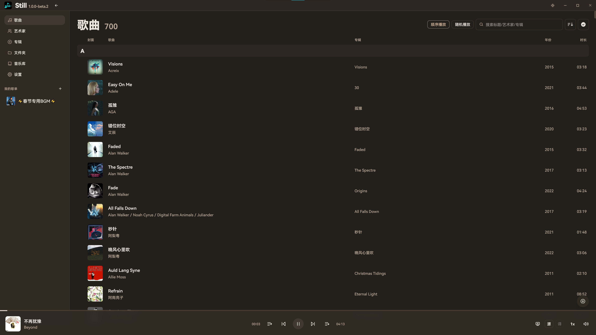 | 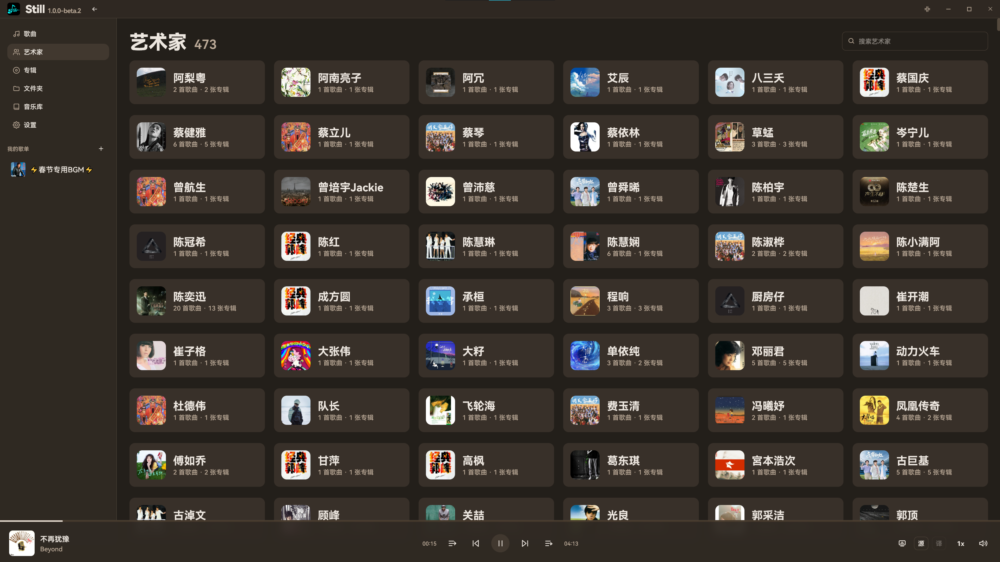 |

| 专辑列表（标题没有展示，因为上面的音频年份未填入） | 专辑页面 |
|---|---|
|  | 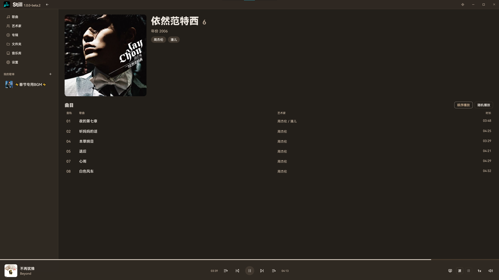 |

| 艺术家歌曲 | 艺术家专辑 |
|---|---|
| 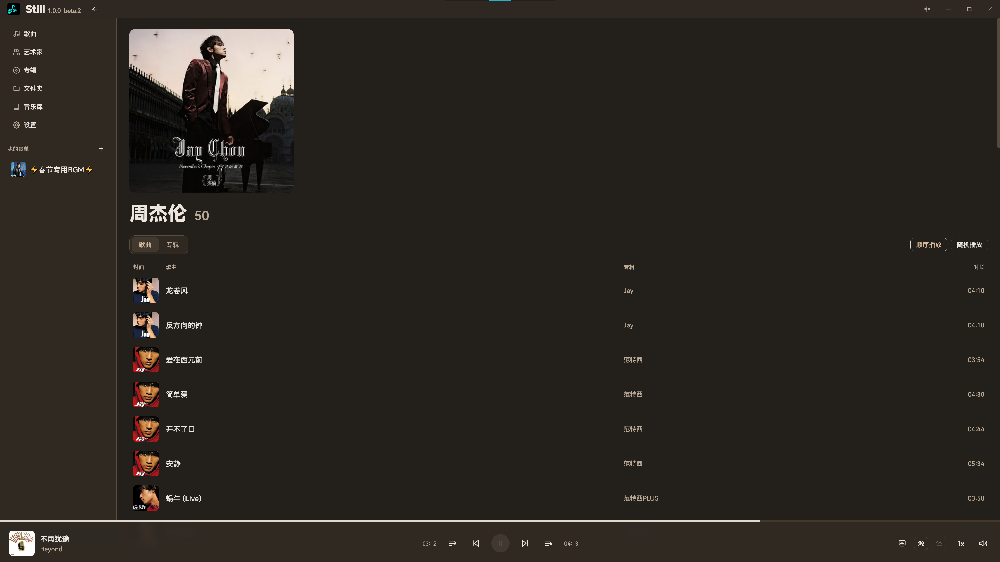 |  |

| 歌单 | 歌曲列表<br>按艺术家排序时支持按 专辑及其年份 进行二次排序<br>专辑内按照 音轨号 排序 |
|---|---|
| 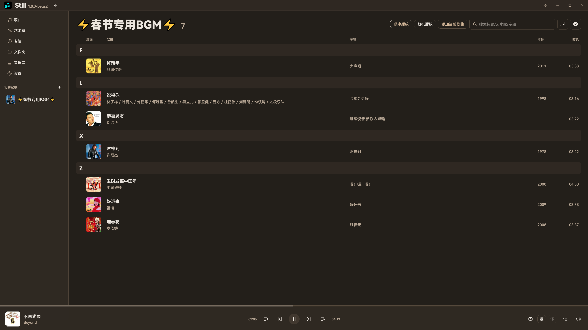 | 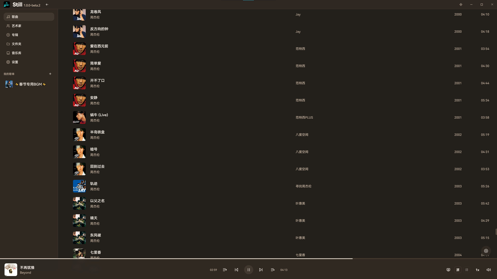 |

| 快速跳转面板 能够快速定位歌曲 | 个性化设置 |
|---|---|
| 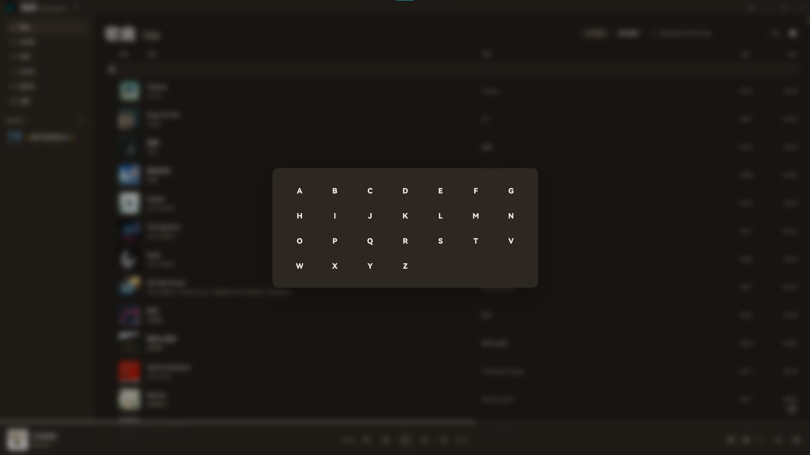 | 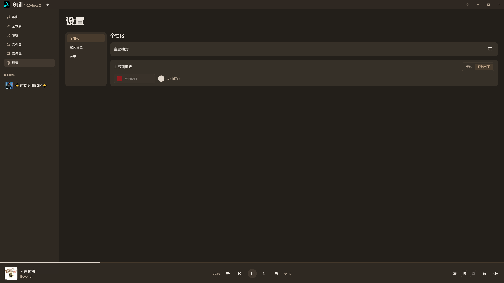 |

| 全屏歌词设置 | 桌面歌词设置 |
|---|---|
| 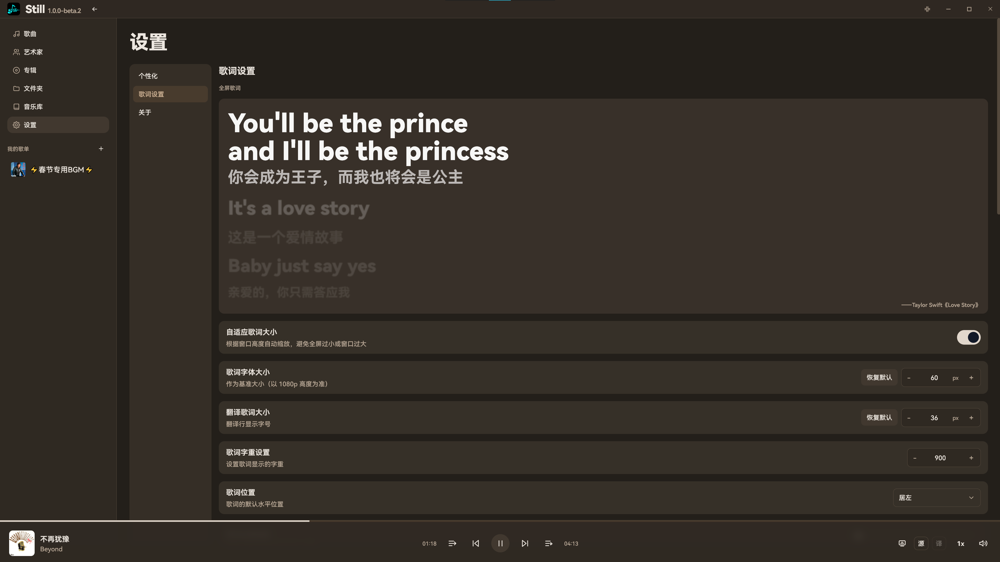 | 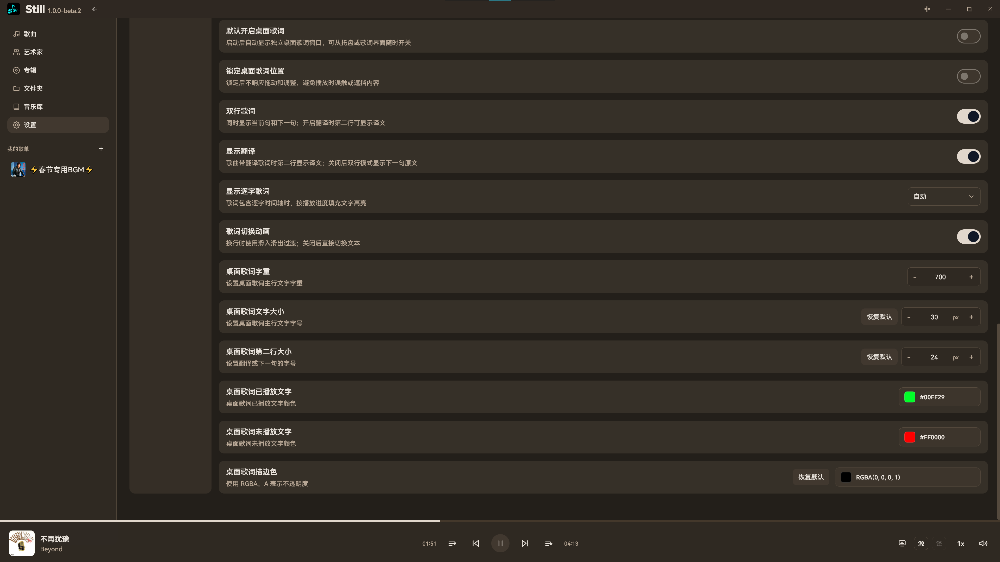 |

### 全屏歌词

| 纯歌词 | 封面模式 |
|---|---|
| 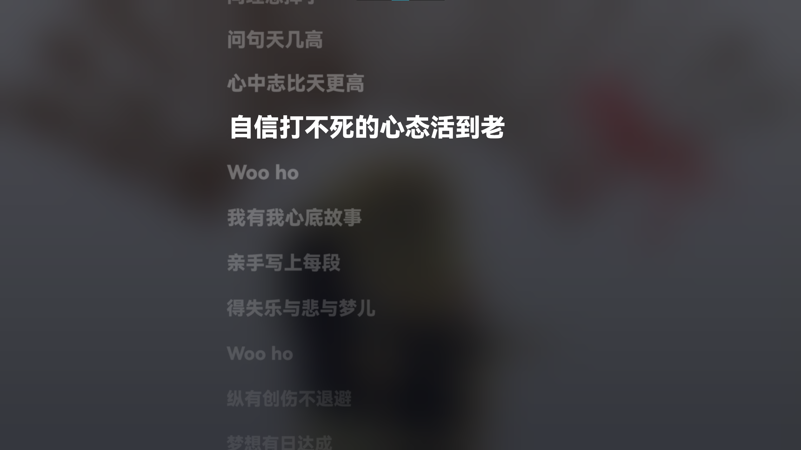 | 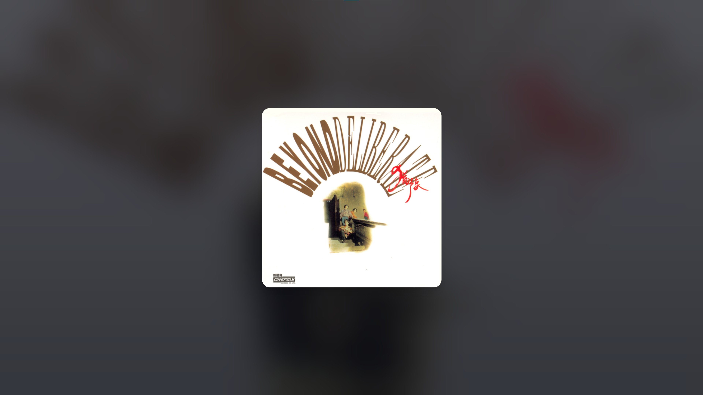 |

| 横向混合 | 竖向混合 |
|---|---|
| 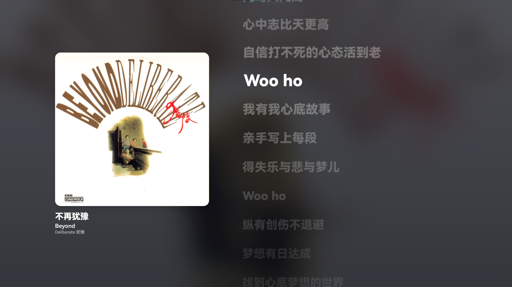 | 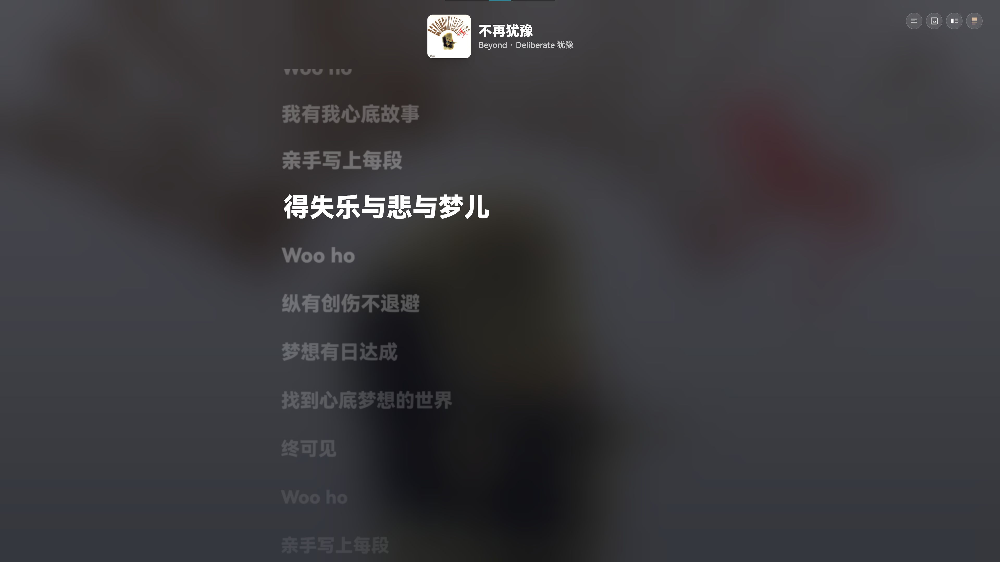 |

| 纯歌词 竖屏效果更佳 | 竖向混合 竖屏效果更佳 |
|---|---|
| 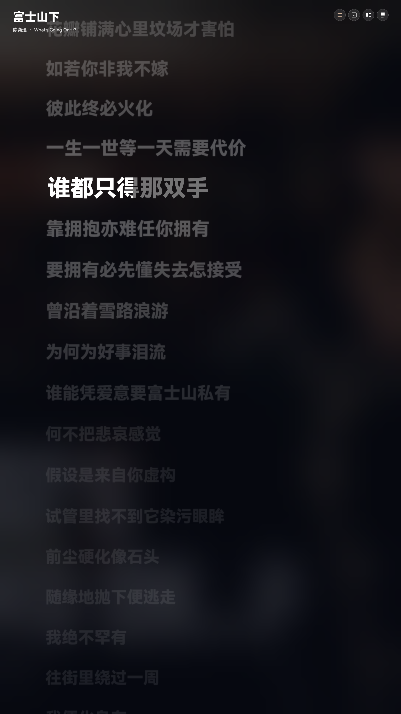 | 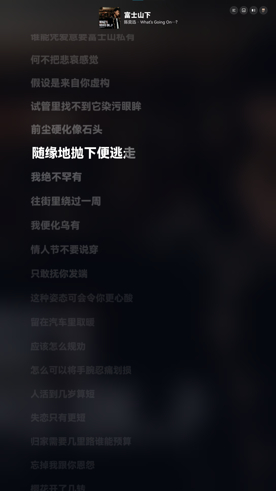 |

| 单行翻译（示例为粤语歌曲） | 双行翻译（示例为日语歌曲） |
|---|---|
|  | 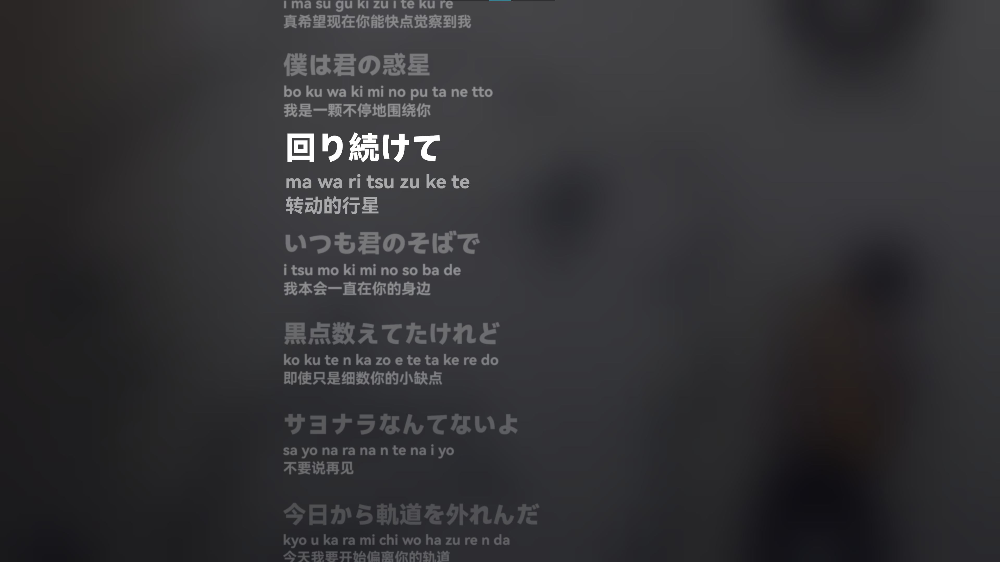 |

### 桌面歌词

| 双行歌词 开启翻译（桌面歌词面板） | 双行歌词 关闭翻译 |
|---|---|
| 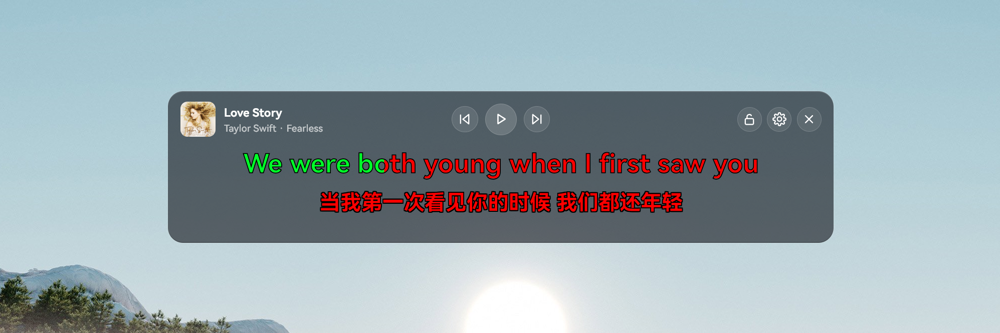 |  |

| 单行歌词 |
|---|
|  |

## 功能亮点

### 本地音乐库

- 导入本地音乐文件夹，自动递归扫描音频文件
- 按歌曲、艺术家、专辑、文件夹和歌单浏览音乐
- 支持搜索和多种排序方式
- 支持按标题、艺术家、专辑、年份、时长、文件名、修改时间和文件大小排序
- 支持播放队列、插播、拖拽调整队列顺序
- 支持歌单管理和右键快捷操作

### 元数据与封面

- 读取标题、艺术家、专辑、年份、曲目编号和时长
- 读取文件大小、修改时间、音频格式、编码、码率、采样率、位深、声道和无损标记
- 支持内嵌封面
- 支持常见文件夹封面文件，例如 `cover.jpg`、`folder.png`、`front.jpg`、`album.png`、`artwork.jpg`
- 使用元数据缓存提升重复导入和刷新速度

### 歌词体验

- 支持内嵌歌词和本地歌词文件
- 支持 `.lrc`、`.tlrc`、`.txt` 和 `lyrics.lrc`
- 支持翻译歌词识别
- 支持歌词时间偏移调整
- 支持逐词高亮、双语显示、歌词复制和全屏歌词
- 全屏歌词支持歌词、封面、横向混合和竖向混合显示模式

### 桌面歌词

- 支持独立桌面歌词窗口
- 支持拖动、锁定、位置记忆
- 支持双行歌词、翻译显示、逐词显示和切换动画
- 支持自定义字体大小、字重、颜色和描边

### 播放与系统体验

- 支持顺序播放、列表循环、单曲循环和随机播放
- 支持播放速度、音量控制和静音
- 支持系统媒体控制
- 支持系统托盘
- 支持深色模式、浅色模式和跟随系统主题
- 支持手动强调色和基于封面的强调色

## 安装使用

前往 [Releases](https://github.com/lrm-com/Still/releases) 下载最新版本。

- `Still.Setup.*.exe`：Windows 安装包
- `Still.*.exe`：便携版

## 开发

安装依赖：

```bash
npm install
```

启动开发服务器：

```bash
npm run dev
```

构建前端资源：

```bash
npm run build
```

打包 Windows 应用：

```bash
npm run dist
```

仅生成未安装包目录：

```bash
npm run pack
```

## 项目结构

```text
electron/      Electron 主进程和预加载脚本
src/           React 应用源码
logo/          应用图标和 logo 资源
dist/          前端构建输出，未提交
release/       Electron 打包输出，未提交
```

## 技术栈

- React
- TypeScript
- Vite
- Electron
- Material Web
- Framer Motion
- Tailwind CSS
- music-metadata
- music-metadata-browser
- jsmediatags

## 说明

Still 目前仍处于 beta 阶段，功能和界面会继续迭代。欢迎在 Issues 中反馈问题或建议。
